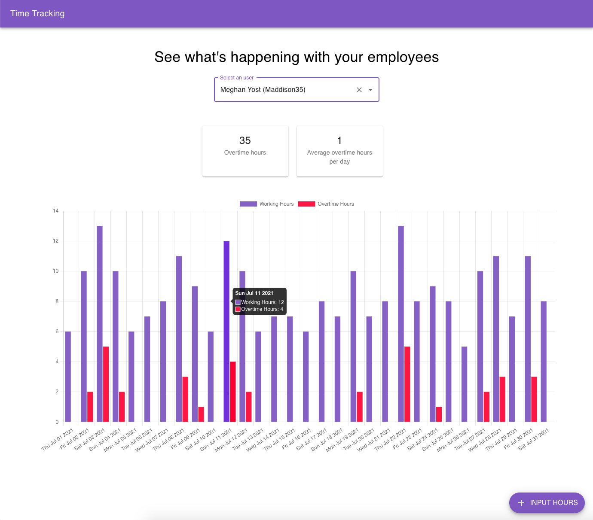
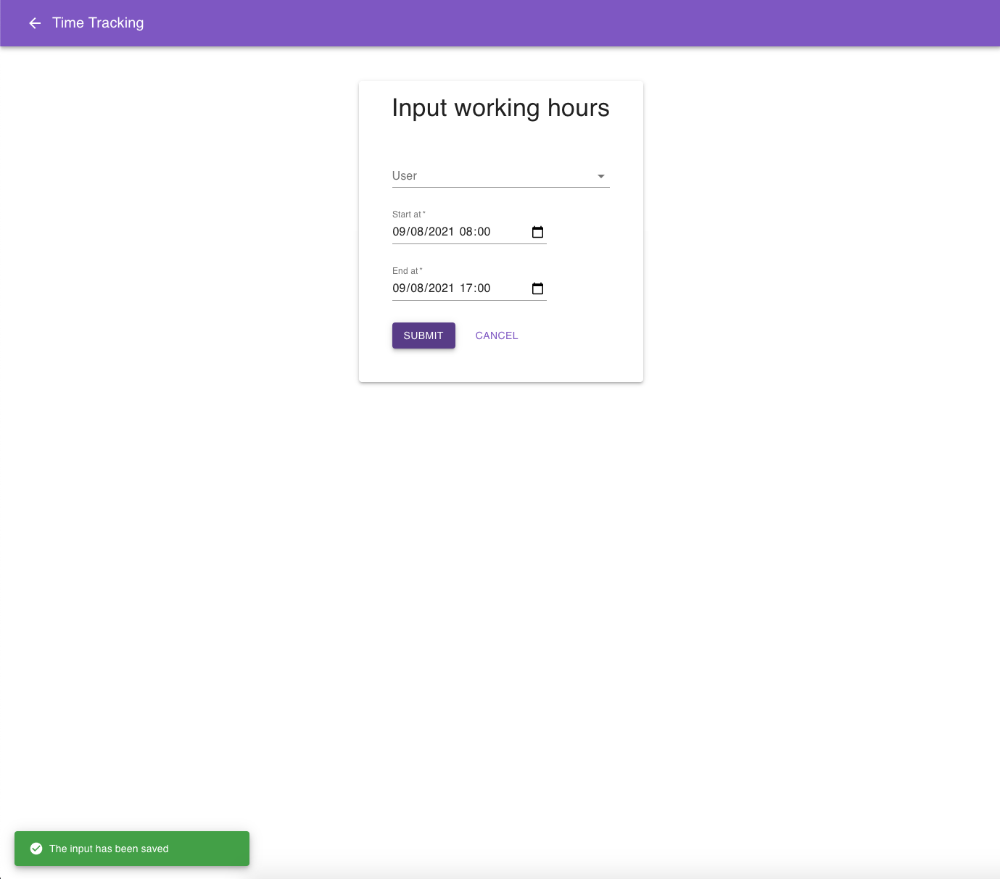

# Time tracking SPA

## Introduction

Frontend of a time tracking application for employees of a company.
In this MVP, you can input hours of work per day and see statistics of hours worked and overtime hours for each user.





This project was bootstrapped with [Create React App](https://github.com/facebook/create-react-app).

## Installation and configuration

### Prerequisites

- [Node.js](https://nodejs.org/en/) v14.17.0 or later. Feel free to use [nvm](https://github.com/nvm-sh/nvm) (a `.nvmrc` file is included)
- [Docker](https://www.docker.com/) and [Docker Compose](https://docs.docker.com/compose/)

### Container execution

You can run the application in a container with `docker-compose`:

```bash
$ docker-compose build
$ docker-compose up
```

### Installation

```bash
$ npm i
```

### Execution

```bash
$ npm start
```

This command will start the application in development mode using a local backend server.

### Test

```bash
$ npm test
```
